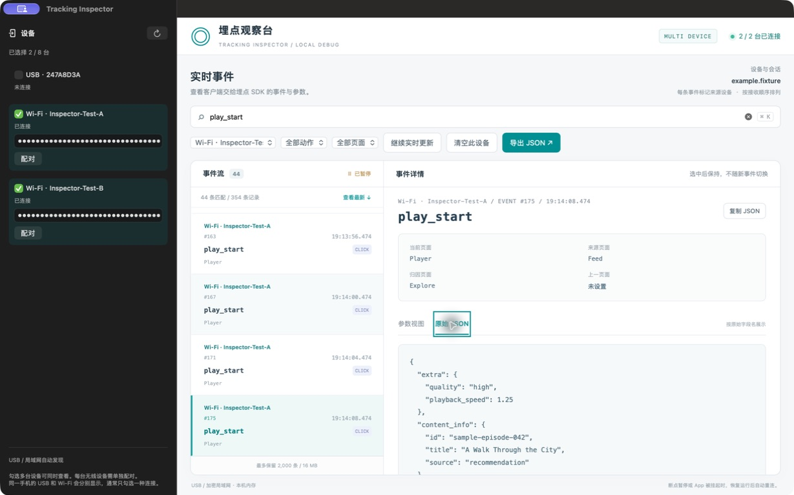
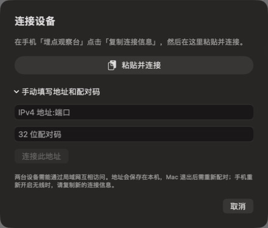
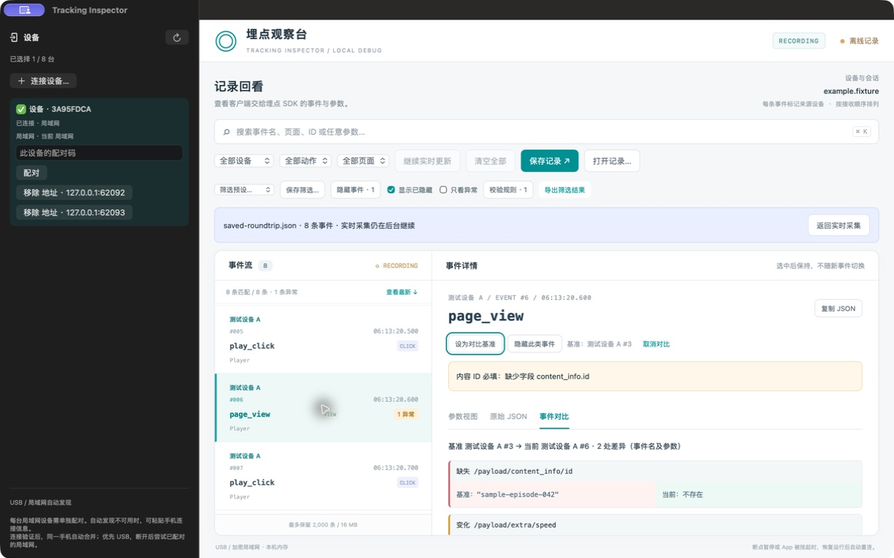
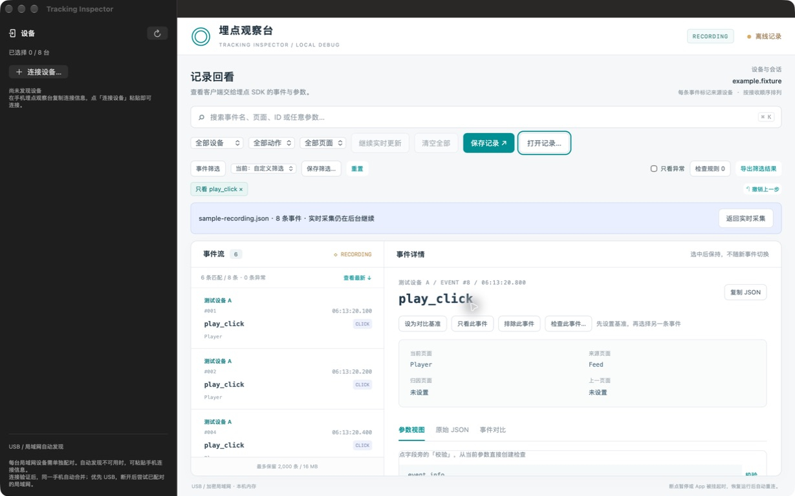

<p align="center">
  
</p>

# Tracking Inspector

一个用于查看 iOS Debug 埋点的 macOS 桌面应用。同时连接多台设备查看事件、搜索任意参数、按设备、页面和动作筛选，比较两条事件的字段差异、自定义规则检查异常，并保存或重新打开调试记录。

- **USB**：连接并信任 Mac，运行已接入采集协议的 Debug App，选择 USB 设备。
- **局域网**：手机复制完整连接信息，Mac 点击「粘贴并连接」即可配对。也支持 Bonjour 自动发现及手动填写 IP、端口和配对码。
- **独立运行**：使用系统的 USB 服务、Network.framework 和 WKWebView，不需要 Python、Homebrew、浏览器服务或第三方运行时。
- **多设备**：最多同时连接 8 台，验证身份后自动合并同一手机的 USB、Bonjour 和手动连接；优先 USB，已配对的局域网作为备用。
- **事件分析**：字段对比、一键只看或排除事件、保存筛选，从参数直接创建校验并预览异常。
- **记录回看**：保存当前记录或筛选结果，打开历史 JSON 后继续搜索、对比和校验。

> 这是观察客户端事件的工具。iOS App 需要接入 [采集协议](Docs/protocol.md)，它不能直接读取任意 App 的埋点；事件出现也不代表服务端接收成功。

## 下载

从 [GitHub Releases](https://github.com/CoderQHao/tracking-inspector/releases/latest) 下载 `Tracking-Inspector-0.3.1-universal.dmg`，打开后将应用拖到 `Applications`。DMG 同时支持 Apple Silicon 和 Intel；运行不需要开发环境。

当前是 ad-hoc 签名的开发版本，尚未经过 Developer ID 签名与 Apple 公证；其他 Mac 下载后可能被 Gatekeeper 拦截。Release 提供 `SHA256SUMS` 校验文件，签名与公证仍是后续正式分发需要补齐的部分。

## 界面预览

多设备事件流：同时查看各设备的连接状态、事件来源和参数详情。


按设备和事件名筛选，直接查看选中事件的原始 JSON，也可以复制或导出当前筛选结果。



> 截图来自实际运行的 Mac 应用，事件由独立开发测试端生成，不包含真实埋点。正式应用没有内置模拟设备或演示数据。

一次粘贴即可连接；旧版采集端也可以展开手动填写。



记录回看、字段差异与异常校验（左侧为同一独立测试端的两个连接入口）：



筛选条件直接展示，排除可撤销；保存前预览规则会命中哪些记录。




## 使用

1. 打开 `Tracking Inspector.app`。
2. USB：连接手机、解锁并信任 Mac，在手机上运行 Debug App。只有一台 USB 设备且没有历史选择时会自动选中。
3. 无线：Mac 和手机连接可互通的局域网，在手机调试入口开启无线读取，允许局域网访问。手机点击「复制连接信息」，将完整内容复制到 Mac 剪贴板后，在 Mac 点击「连接设备…」→「粘贴并连接」。支持通用剪贴板的设备可直接跨设备粘贴；其他情况下可自行将这段信息传到 Mac。
4. 勾选多台设备即可同时接收，事件流按 Mac 接收顺序合并，并显示来源设备。设备时钟可能不一致，不将手机时间当作跨设备的严格时序。
5. 使用「全部设备」下拉框聚焦某台设备；`⌘K` 搜索。「清空此设备」仅清理当前设备，「清空全部」清理全部已选设备。「保存记录」保存当前保留的全部事件（包含隐藏事件），「导出筛选结果」只导出匹配项；每条记录保留设备 ID、名称和会话。

同一手机的连接在第一次成功读取并确认身份后合并为一个设备卡片，卡片显示当前通道；待验证的入口暂时单独显示。需要先连接并配对备用局域网入口，才能在拔线后自动接续；事件依据会话和 ID 去重。Mac 重启后会恢复每台设备的一个优先入口，配对和其他入口身份需要重新确认。新采集端可返回稳定匿名 `deviceID`；旧端依靠会话标识，在同一次 App 运行内合并。

旧版采集端仍可使用：展开连接面板的「手动填写地址和配对码」，分别填写 `IPv4 地址:端口` 与 32 位配对码；或勾选自动发现的局域网设备并配对。连接信息含有配对码，只应粘贴到自己信任的观察台。App 不自动读取剪贴板，只在点击「粘贴并连接」时读取。

Bonjour 不需要固定 IP。手动地址会保存到本机，手机换网络或重新开启无线后，IP 或端口可能改变，需要移除旧地址并填写新地址。设备选择会记住，断线后等待原连接，不会自动选择其他设备。某台 App 重启只清空它自己的旧会话，不影响其他设备。取消勾选会移除该设备当前缓存，再次勾选时重新读取手机保留的事件。断点暂停、切入后台或系统挂起时可能暂时无法读取，恢复前台运行后自动重连。

手机重启 App、关闭后重新开启无线读取，会更换配对码，需重新配对。Mac 退出也会忘记配对码。

相同 Wi-Fi 名称不保证处于同一 IP 子网；Bonjour 通常无法跨子网发现。手动连接可绕过发现环节，但不能绕过网络隔离、防火墙或失效端口。连接失败时核对手机当前地址、配对码、两端局域网权限，以及 VPN / 代理的局域网规则；也可使用 USB。局域网标签表示连接协议，不能证明当前流量一定经过 Wi-Fi；连着 USB 时也可能经过 USB 提供的网络接口。

## 对比、筛选与校验

- 选中事件后点击「设为对比基准」，再选择另一条事件。「事件对比」展示事件名和参数中新增、缺失、值或类型变化的字段；数组按索引比较，基准保留到取消或切换记录。
- 在事件行或详情点击「只看」或「排除」，列表上方会展示正在生效的条件。点击条件的 × 移除，或点击「撤销上一步」恢复。打开「事件筛选」可以搜索事件类型、查看数量、恢复排除；排除只影响显示，记录仍会保留。
- 点击「保存筛选」确认条件摘要、填写名称即可保存；下次从工具栏下拉框直接选择。保存事件名、搜索、动作、页面、排除列表和异常开关，设备选择保持独立。修改已保存筛选后显示「已修改」，点击「更新此筛选」保存变化；「重置」回到全部事件。
- 在参数旁点击「校验」，自动带入事件、字段和样本值，选择检查条件后即可保存。右侧预览打开面板时已有记录的匹配、通过和异常数量，以及具体原因；保存后继续检查新事件。也可以从「检查规则」管理已有规则或新建规则。
- **字段不能为空**检查缺失、null、空文本、空数组和空对象，0 和 false 有效；**字段必须存在**只检查是否存在，兼容旧版必填规则。
- **类型**从中文选项中选择期望类型；**允许值**点选记录里出现过的值，或逐项输入，无需手填 JSON。两者可直接勾选「字段缺失时也报错」。旧规则保持原来的可选字段语义。
- **更多设置**中可自定义名称、用 `*` 通配符匹配一批事件。日常从字段点选不需要输入路径；尚未出现的字段可手动填写 `content_info.id` 或 JSON Pointer `/content_info/id`（键含点号时用后者）。

- **重复触发**在同一设备、同一会话、同名事件内比较，窗口 0.001–60 秒。可指定多个参数路径作为判重依据，留空则比较完整参数；后一次触发显示关联事件编号。它只分析当前保留的记录，不能判断已经淘汰或未采集的事件。
- 异常会出现在事件行和详情中，也可以勾选「只看异常」。最多保存 50 条规则、20 个预设、100 种隐藏事件；设置总大小限制 256 KiB。

## 保存和回看

「保存记录」是当前保留事件的快照，不是无限时长的录制。暂停时保存暂停的显示快照；需要最新事件时先恢复实时更新。「导出筛选结果」适合只保存本次排查的事件。

「打开记录」通过系统文件面板读取 JSON，支持新 `formatVersion: 3` 和旧 `formatVersion: 2` 导出。文件不超过 40 MiB，展开后不超过 2,000 条 / 16 MiB；无效记录会整体拒绝，不覆盖当前查看内容。离线记录使用当前本机的筛选和校验规则，不从文件执行代码或导入设置。点击「返回实时采集」回到后台持续接收的事件流。

## 构建

需要 macOS 13+、Xcode 16+（含 Command Line Tools）。不依赖任何远程 Swift Package。

```sh
bash Scripts/build-app.sh
# 同时包含 Apple Silicon 和 Intel
bash Scripts/build-app.sh --universal
# 构建通用版、DMG 和校验文件
bash Scripts/build-dmg.sh
```

输出：

- `dist/Tracking Inspector.app`
- `dist/Tracking-Inspector.zip`
- `dist/Tracking-Inspector-0.3.1-universal.dmg`（运行 DMG 脚本后）
- `dist/SHA256SUMS`

默认使用 ad-hoc 签名，适合本地开发。仓库产物尚未做 Developer ID 签名与 Apple 公证；下载到其他 Mac 时，Gatekeeper 可能拦截。正式分发需使用自己的 Developer ID 并完成公证，脚本支持 `SIGNING_IDENTITY`，不会自动选择证书或执行公证。

GitHub Actions 会运行测试，构建通用版本，并上传 DMG、ZIP 和校验文件到对应 workflow run 的 Artifacts。

发布新版本时，先更新 `Resources/Info.plist` 的版本号并添加 `Docs/releases/vX.Y.Z.md`，待主分支 CI 通过后推送对应 `vX.Y.Z` tag。Release workflow 会重新测试和构建，再将 DMG、ZIP、校验文件发布到 GitHub Release；tag 必须与 App 版本一致。

## 验证

```sh
swift test --build-system native --enable-swift-testing --disable-xctest
node --test Tests/*.test.mjs
```

Node.js 只用于开发时测试事件缓存；运行应用不需要 Node.js。Swift Testing 覆盖 HTTP/TLS、设备身份合并、USB 优先与拔线切换、地址复用、重新配对的旧回包隔离。JavaScript 测试覆盖缓存与合并、字段差异、筛选、预设、五类校验规则及旧设置兼容，以及新旧记录格式导入和容量限制。

## 数据与连接

- USB 只通过 macOS `usbmuxd` 访问选定设备的 `127.0.0.1:18765`。
- 无线发现使用 `_trackinspect._tcp`。事件在 TLS 1.2 PSK 通道中传输，使用 128 位随机配对密钥和 AES-128-GCM；Bonjour 不发布密钥。
- 无线读取由手机显式开启；采集端必须在关闭时取消已连接客户端。手动连接使用相同的 TLS 配对校验。配对码仅保存在 Mac 进程内存中，已勾选的设备标识及手动地址会保存到本机偏好。
- 实时事件默认只保留在本机内存，所有设备合计最多 2,000 条 / 16 MiB 的序列化大小估算；暂停时另保留一份有相同上限的显示快照。实际进程内存还包含对象和界面开销。
- 「清空」从下一次快照边界开始，既有请求和积压不会把旧记录补回来。暂停只冻结界面，后台仍然读取并执行容量限制。
- 筛选预设、隐藏列表和校验规则保存在本机偏好。导入记录单独占用最多 2,000 条 / 16 MiB，回看时实时采集继续执行原有容量限制。
- 只在用户点击复制或保存记录时将事件写入剪贴板或文件。不上传至云端，不包含产品 SDK、业务源码、真实埋点或私有凭据。

界面采用原生设备栏与系统保存面板，事件工作区采用应用内置的 WKWebView 页面。页面无远程依赖，外部页面导航被禁用。

### 开发时验证多设备

正式 App 没有内置模拟设备。开发者可另开终端执行 `bash Scripts/run-fixtures.sh`，启动两个独立的 TLS / Bonjour 测试端；在观察台选择它们并用终端给出的测试配对码连接。

测试端只产生虚构事件，不读取手机或业务数据。每个测试端还提供一个同身份的备用端口，连接两个地址可验证合并与去重。输入 `pause-a`、`resume-a`、`restart-a` 可验证一台设备暂停与重启时另一台仍能读取；B 同理。Ctrl-C 停止测试端。该工具及数据位于 `Tests/Fixtures`，不会编译或复制进 `.app`、DMG、ZIP。
