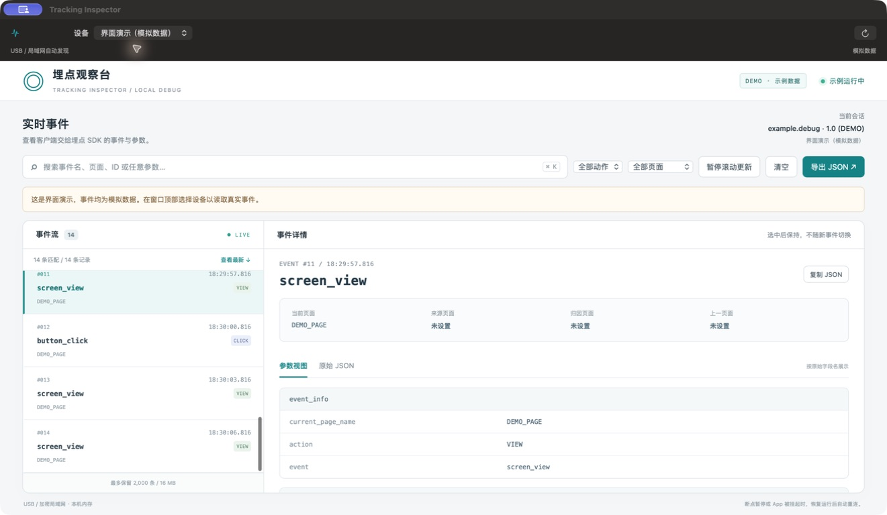

# Tracking Inspector

一个用于查看 iOS Debug 埋点的 macOS 桌面应用。实时查看事件、搜索任意参数、按页面和动作筛选，检查字段或原始 JSON，并通过系统保存面板导出。

- **USB**：连接并信任 Mac，运行已接入采集协议的 Debug App，选择 USB 设备。
- **Wi-Fi**：手机开启无线采集，Mac 自动发现 Bonjour 设备；粘贴手机上的配对码后连接。
- **独立运行**：使用系统的 USB 服务、Network.framework 和 WKWebView，不需要 Python、Homebrew、浏览器服务或第三方运行时。
- **内置演示**：没有设备时，选择「界面演示（模拟数据）」。

> 这是观察客户端事件的工具。iOS App 需要接入 [采集协议](Docs/protocol.md)，它不能直接读取任意 App 的埋点；事件出现也不代表服务端接收成功。



## 使用

1. 打开 `Tracking Inspector.app`。
2. USB：连接手机、解锁并信任 Mac，在手机上运行 Debug App。只有一台 USB 设备且没有历史选择时会自动选中。
3. 无线：Mac 和手机连接同一局域网，在手机调试入口开启无线读取，允许局域网访问。在 Mac 顶部选择对应 Wi-Fi 设备，粘贴 32 位配对码并点击「配对」。
4. 操作手机，左侧查看事件，右侧查看选中的参数。`⌘K` 搜索；「导出 JSON」导出当前筛选结果。

无线不需要固定 IP。设备选择会记住，断线后等待原设备，不会自动切换到别人的手机。App 重启造成的会话变化会清空旧列表。断点暂停、切入后台或系统挂起时可能暂时无法读取，恢复前台运行后自动重连。

手机重启 App、关闭后重新开启无线读取，会更换配对码，需重新配对。Mac 退出也会忘记配对码。局域网有客户端隔离或系统防火墙限制时，设备发现或连接可能失败；此时可使用 USB。

## 构建

需要 macOS 13+、Xcode 16+（含 Command Line Tools）。不依赖任何远程 Swift Package。

```sh
bash Scripts/build-app.sh
# 同时包含 Apple Silicon 和 Intel
bash Scripts/build-app.sh --universal
```

输出：

- `dist/Tracking Inspector.app`
- `dist/Tracking-Inspector.zip`

默认使用 ad-hoc 签名，适合本地开发。仓库产物尚未做 Developer ID 签名与 Apple 公证；下载到其他 Mac 时，Gatekeeper 可能拦截。正式分发需使用自己的 Developer ID 并完成公证，脚本支持 `SIGNING_IDENTITY`，不会自动选择证书或执行公证。

GitHub Actions 会运行测试，构建通用版本，并上传 ZIP 到对应 workflow run 的 Artifacts。

## 验证

```sh
swift test --build-system native --enable-swift-testing --disable-xctest
node --test Tests/web-model.test.mjs
```

Node.js 只用于开发时测试事件缓存；运行应用不需要 Node.js。Swift Testing 覆盖 HTTP 分片、协议边界、TLS 配对与取消；JavaScript 测试覆盖重连去重、会话重置、清空、暂停、筛选与内存限制。

## 数据与连接

- USB 只通过 macOS `usbmuxd` 访问选定设备的 `127.0.0.1:18765`。
- 无线发现使用 `_trackinspect._tcp`。事件在 TLS 1.2 PSK 通道中传输，使用 128 位随机配对密钥和 AES-128-GCM；Bonjour 不发布密钥。
- 无线读取由手机显式开启；采集端必须在关闭时取消已连接客户端。配对码仅保存在 Mac 进程内存中，最后选择的设备标识会保存到本机偏好。
- 事件只保留在本机内存，最多 2,000 条 / 16 MiB 的序列化大小估算；暂停时另保留一份有相同上限的显示快照。实际进程内存还包含对象和界面开销。
- 「清空」从下一次快照边界开始，既有请求和积压不会把旧记录补回来。暂停只冻结界面，后台仍然读取并执行容量限制。
- 只在用户点击复制或导出时写入剪贴板或文件。不上传至云端，不包含产品 SDK、业务源码、真实埋点或私有凭据。

界面采用原生设备栏与系统保存面板，事件工作区采用应用内置的 WKWebView 页面。页面无远程依赖，外部页面导航被禁用。
