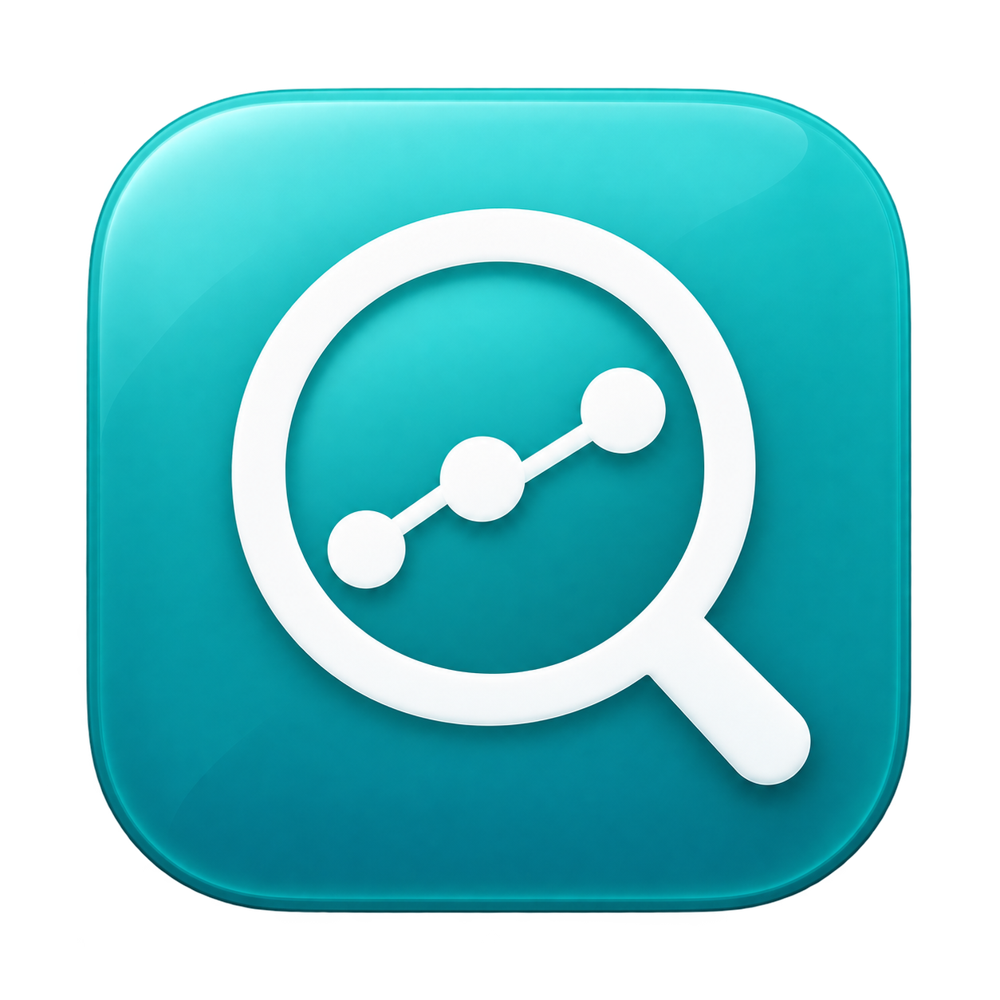
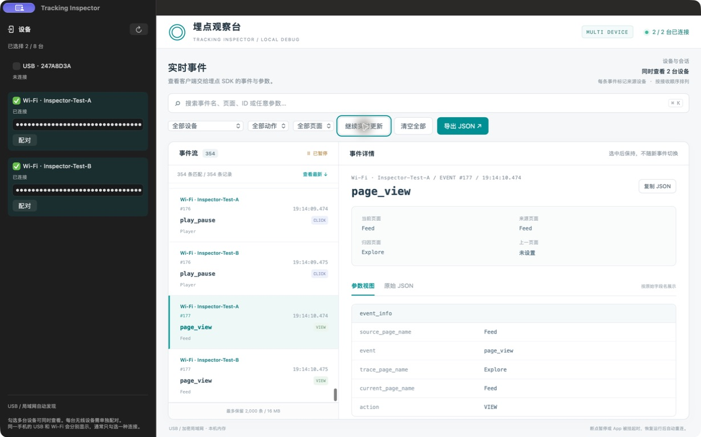
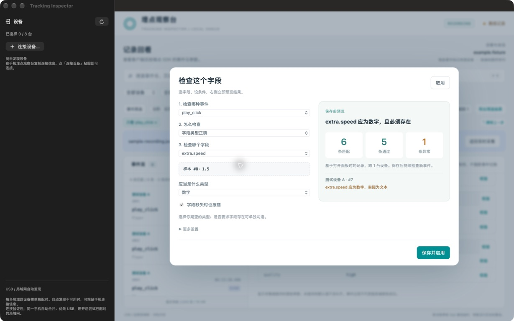

  

# Tracking Inspector

在 Mac 上直观查看 iOS Debug 埋点。支持 USB / 局域网连接。

iOS App 需接入 [采集协议](Docs/protocol.md)。

## 下载

[下载最新 DMG](https://github.com/CoderQHao/tracking-inspector/releases/latest)，打开后将应用拖入 `Applications`。

支持 **macOS 13+，仅限 Apple Silicon（M 系列芯片）**。目前使用 ad-hoc 签名，尚未经过 Apple 公证，首次打开可能被系统拦截；Release 附带 `SHA256SUMS` 校验文件。

## 功能

- 同时查看最多 8 台设备；USB 优先，已配对的局域网连接可在拔线后接续。
- 菜单栏常驻：查看连接状态、打开观察台、连接或刷新设备。关闭窗口后继续采集，重新打开恢复当前保留的记录。
- 页面适配宽屏，最新接收的事件显示在顶部；查看旧事件时保持阅读位置。
- 搜索参数、按设备和事件筛选，一键只看或排除事件，保存常用筛选。
- 比较两条事件的字段差异，从参数直接创建校验规则并预览异常。
- 保存调试记录，离线回看、搜索和分析。

## 使用

1. 在手机运行已接入采集协议的 Debug App。
2. **USB**：连接、解锁并信任 Mac，在观察台选择设备。
3. **无线**：两端连接可互通的局域网，手机开启无线读取并复制连接信息；Mac 点击「连接设备… → 粘贴并连接」。也支持自动发现和手动输入地址。
4. 操作手机，查看事件；选中一条事件「设为对比基准」，再选另一条即可比较。

无线连接失败时检查局域网权限、地址和配对码，以及 VPN 是否允许局域网流量。iOS 挂起 App 时读取会暂停，恢复运行后自动重连。

关闭窗口不会退出应用；从菜单栏或 Dock 可重新打开同一个观察台。暂停更新只冻结页面显示，后台继续接收事件。记录在本次运行的内存中最多保留 2,000 条 / 16 MB；退出前可用「保存记录」导出，退出后不会自动保留。Mac 休眠期间无法持续采集，唤醒后会尝试补读手机仍保留的事件。

## Xcode 开发

使用 Xcode 16+ 打开 `TrackingInspector.xcodeproj`，选择 `TrackingInspector` scheme 和 `My Mac`：`⌘R` 运行、`⌘U` 测试、`Product → Archive` 归档。默认本机签名，无需配置开发者账号。

版本号在 App target 的 `General` 中修改；图标位于 `Resources/Assets.xcassets`，核心逻辑为本地 `InspectorCore` Package。执行 `bash Scripts/build-dmg.sh` 可通过同一工程生成 DMG。
